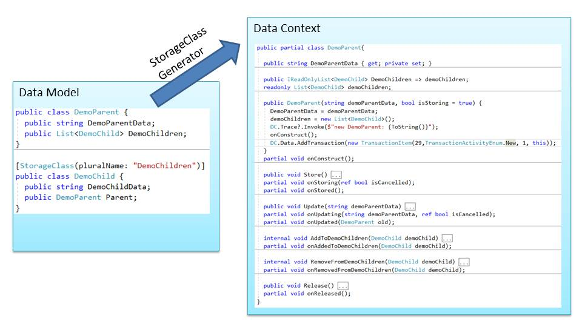

# Introduction
*StorageLib* is a single user C# only library for lightening fast object oriented data storage in RAM and 
long term storage on a local harddisk. No database required.

**Main features**
* object oriented data storage in RAM using collections like List, Dictionary and SortedList 
for parent child relationships
* flat file storage per class in CSV file for permanent storage (optional)
* automatically created *create*, *store*, *update* and *release* (CRUD) operations
* developer does not need to write any boiler plate code
* finely grated extensibility of generated code by using partial classes
* support for readonly and nullable properties
* transactions (start, rollback and commit transaction)
* fast backup at application start if requested
* fast compacting of files at application end
* detailed tracing for debugging
* maximum data size depends on available RAM
* high speed: 30'000 transactions per second including permanent storage
* ideal for single user applications
* data files can be read and manipulated with any Editor

Using a database for single user applications just to store data permanently is overkill, adds 
a lot of unnecessary complexity and slows down the program execution.

Nowadays PC have lots of RAM. For many single user applications is it possible to keep all the 
data in RAM and to do queries using Linq, which leads to much faster programs than interfacing 
with a "slow" database. Also the mismatch between data types in DotNet and databases
can be avoided.

To store the data permanently, it's enough to write them into local files. This can be done using 
UTF8 instead of binary, which makes it easy to inspect and edit these files with any Editor, but 
the storage requirement is not much bigger. Storing '1234567' as string takes the same space 
(7 bytes plus delimiter) like storing it as 8 byte binary.

This library contains high performance *Readers* and *Writers* for CSV ('comma' separated values) 
files and a code generator for the object related data model in RAM, using .Net 5.

# Code Usage
*StorageLib* comes with a code generator. It reads the definition of data classes from a *source
directory* and writes new versions of the data classes with the abilities to write to and to read 
from CSV files into the *target directory*, together with a *data context* class, which gives access
to all stored data.

# Further Documentation
* [Readme.md](Readme.md) describes main features of *StorageLib* and gives a high level overview how *StorageLib* works.
* [Setup.md](Setup.md) describes how to install a local copy of *StorageLib* on your PC and how to setup VS for your own application using *StorageLib*.
* [Design.md](Design.md) gives a high level introduction into the data design principals of *StorageLib* .
* [DataModel.md](Design.md) explains how to write your Data Model code, which defines the classes *StorageLib* will create for you.

# Project Status
Coding completed and tested. However new functionality will be added over time.
 
The current version is in use in 3 applications.

 

