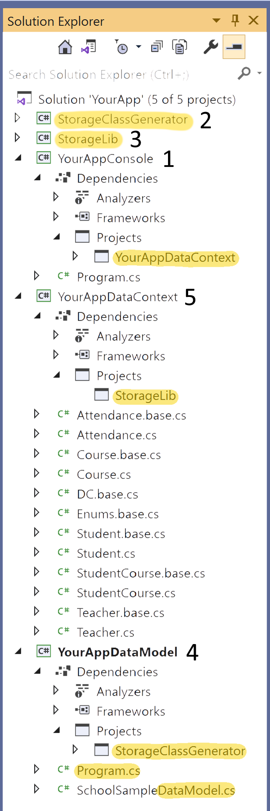

# Introduction  
This document describes how to install a local copy of *StorageLib* on your PC and how to setup 
VS for your own application using *StorageLib*.


# Table of Contents  
[**Setup StorageLib**](#setup-storagelib)  
  
[**Setup your application**](#setup-your-application)  
[**-YourApplication 1**](#yourapplication-1)  
[**-Project StorageClassGenerator 2**](#project-storageclassgenerator-2)  
[**-Project StorageLib 3**](#project-storagelib-3)  
[**-Project Data Model 4**](#project-data-model-4)  
[**--Program.cs**](#program.cs)  
[**--Data Model file**](#data-model-file)  
[**-Project *Data Context* 5**](#project-data-context-5)  
  
[**Further Documentation**](#further-documentation)  


# Setup StorageLib
It might be easiest just to clone *StorageLib* to your PC. This allows you to step through the 
*StorageLib* while debugging. *StorageLib* is extensively tested, but it might be interesting
for you to see what it actually does.

If you clone *StorageLib*, you also need to Install Microsoft.CodeAnalysis.CSharp V3.8 or later 
with Nuget.


# Setup your application
For you own application, create a new solution which could be WPF, WinForm, Console, etc. :



It should have at least 5 projects:

## YourApplication 1
Visual Studio will create the solution together with your first project, which usually creates 
an .exe file. This project can have any name, in the example it is *YourAppConsole*.

For this and any other projects you might add, ensure that the project file contains at least the following settings:

```xml
<PropertyGroup>
<TargetFramework>net5.0</TargetFramework>
<Nullable>enable</Nullable>
</PropertyGroup>
```

## Project StorageClassGenerator 2
Add the external project *StorageClassGenerator* from the *StorageLib* solution you cloned to your own solution. 
*StorageClassGenerator* translates the *data model* into the data classes you will use in
your program.

## Project StorageLib 3
Add the external project *StorageLib* from the *StorageLib* solution you cloned to your own solution. *StorageLib* 
contains the code needed during runtime to store the data.

## Project Data Model 4
Add a new *Console App* project to your solution with any name you like. In the example, the name is 
*YourAppDataModel*. Remember to verify the project settings as described in chapter *YourApplication 1*. 
Add a project reference to *StorageClassGenerator*. 

This project will contain the console program and your definitions for your data classes. 

### Program.cs
*Program.cs* will translate your *data model* into the final data classes. 

Change *Program.cs* to the following code:

```csharp
using StorageLib;
using System;
using System.IO;

namespace StorageModel {

  /// <summary>
  /// Reads all .cs files which are in the same directory like Program. These files 
  /// should contain only data model code. Program creates accordingly .cs files for 
  /// data context and data classes in the folder at targetDirectoryPath.
  /// </summary>
  class Program {

    public static void Main(string[] _) {
      //here are the .cs file(s) stored with the data model
      var sourceDirectory = new DirectoryInfo(Environment.CurrentDirectory).Parent!.Parent!.Parent!; 
      //path to VS solution of your project
      var solutionDirectory = sourceDirectory.Parent!;
      //path of the VS project where the created code should be generated
      var targetDirectoryPath = solutionDirectory.FullName + @"\SampleDataContext"; //<== Enter here the name of your data contect project

#pragma warning disable CA1806 // Do not ignore method results
      new StorageClassGenerator(
        sourceDirectoryString: sourceDirectory.FullName,
        targetDirectoryString: targetDirectoryPath,
        context: "DC"); //<== enter here class name of data context, which gives static access to all data stored.
    }
  }
}
```

Update `targetDirectoryPath` to the file path chosen for the *Data Context* project.

Update `context` if you want to change the name of the class giving static access to all 
stored data. Since this name will be used very often in your code, a really short name is 
recommended, like 'DC'.

### Data Model file
You must add at least one or more .cs files with any names, which contain your *data model*. The 
structure of these files could look like this:

```csharp
using StorageLib;
using System.Collections.Generic;

#pragma warning disable CS8618 // Non-nullable field is uninitialized. 
namespace YourNamespace {

  /// <summary>
  /// Some comment for Parent.
  /// </summary>
  public class Parent {

    /// <summary>
    /// Some Name comment
    /// </summary>
    public string Name;

    /// <summary>
    /// Any child created will automatically get added here.
    /// </summary>
    public List<Child> Children;
  }

  [StorageClass(pluralName: "Children")]
  public class Child {
    public readonly string Name;

    /// <summary>
    /// The child will get added to its parent Children collection.
    /// </summary>
    public Parent Parent;
  }
}
```

Run your *DataModel* console project every time you make a change in your *Data Model*.


## Project Data Context 5
Add a new Class Library project to your solution with any name you like. In the example, the name is 
*YourAppDataContext*. Remember to verify the project settings as described in chapter *YourApplication 1*. 
Add a project reference to *StorageLib*. 

**This project will contain for every class Xyz you define in your *Data Model*:**

* A Xyz.base.cs file. Each time you run *StorageClassGenerator*, these partial Xyz class files
get overwritten. They contain the code for creation, storing, updating and releasing 
(=removal of the object from the *Data Context*) of an instance (object) of the Xyz class.

* A Xyz.cs file. If there is none yet, the *StorageClassGenerator* creates one, but does
not overwrite existing ones. It is also a partial Xyz class with many extension points 
(partial methods) to further customise the behavior of Xyz. This is where you place your
code.

**This project will contain for the *Data Context*:**

* A DC.base.cs file. It holds all the stored instances of the *Data Model* classes in RAM and, 
if configured accordingly, a copy of that data in CSV files. It gives access to your code in other
VS projects through the static variable `DC.Data`, like `DC.Data.Parents`. Each time you run 
*StorageClassGenerator*, this partial class file gets overwritten. You can change the name 'DC'
in the *Data Model* project, Program.cs file, `context` argument in the *StorageClassGenerator* 
constructor call. 

* A DC.cs file. It contains a partial *Data Context* class, where you can add your code if you 
want to extend the behavior of the *Data Context*.

If your program gets bigger, you might want to add a '.gitignore' file to your DataContext 
project, telling git to ignore all '*.base.cs' files. Git doesn't need to store that code, 
because it can be autocreated again by running your *DataModel* console project. The file
should contain code like this

    #some comment explaining that autocreated files can be ignored by git
    *.base.cs


# Further Documentation
* [Readme.md](Readme.md) describes main features of *StorageLib* and gives a high level overview how *StorageLib* works.
* [Design.md](Design.md) gives a high level introduction into the data design principals of *StorageLib* .
* [DataModel.md](DataModel.md) explains how to write your Data Model code, which defines the classes *StorageClassGenerator* will create for you.
